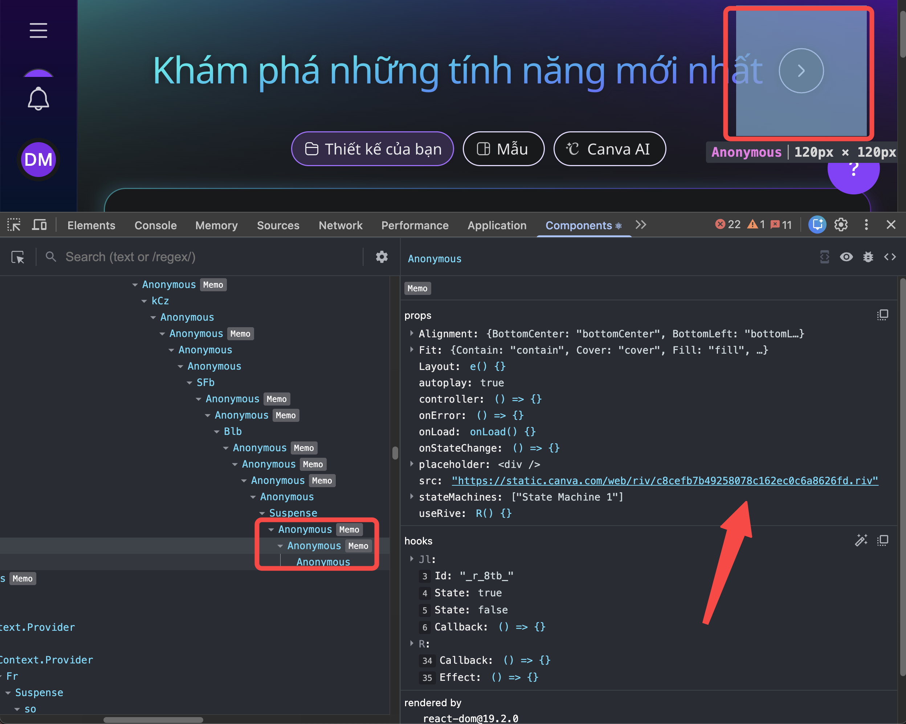
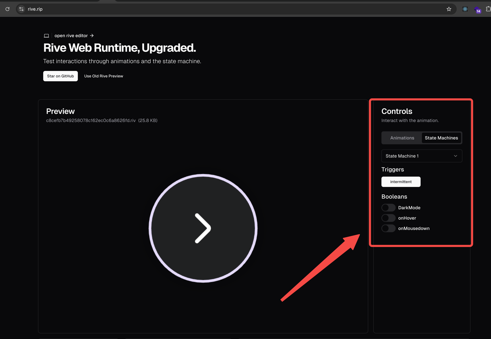
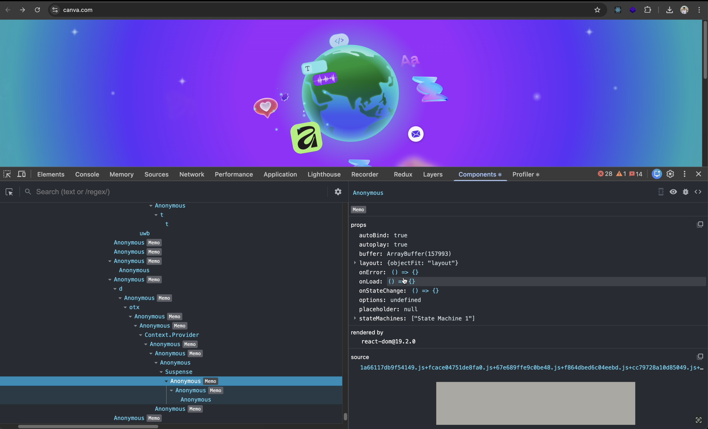
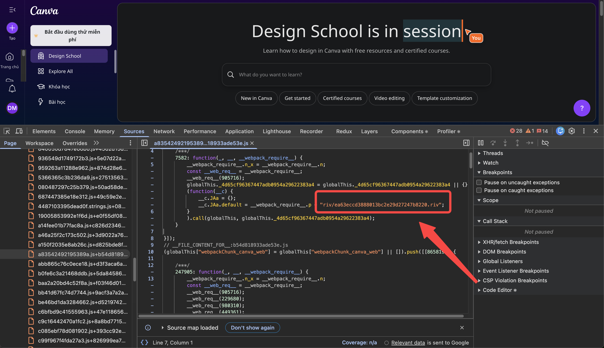
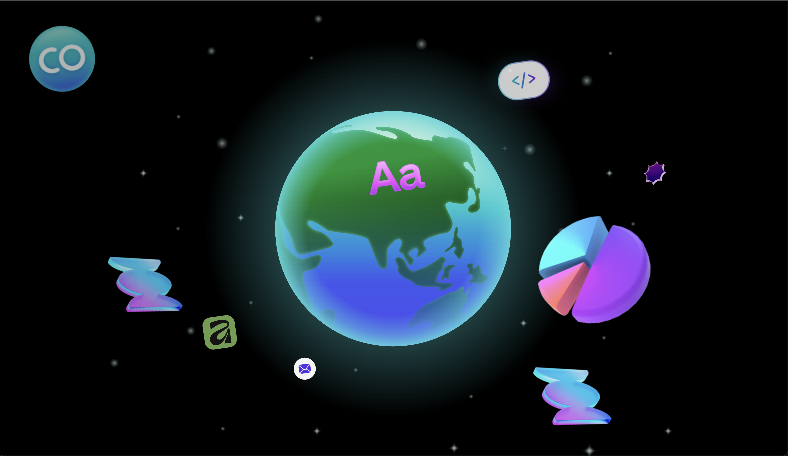
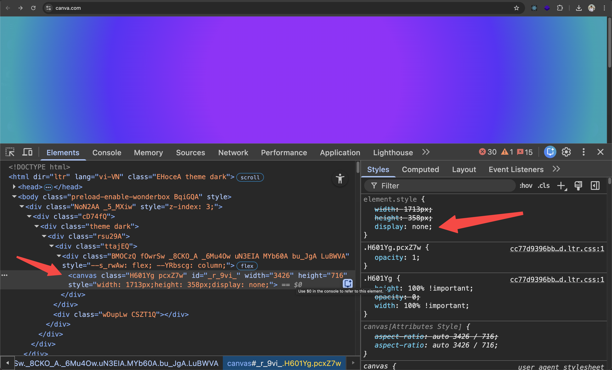
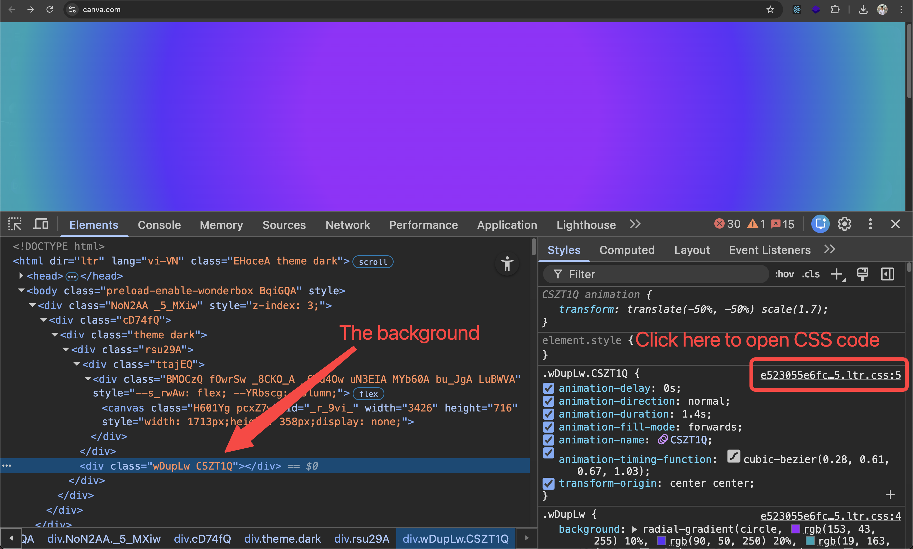
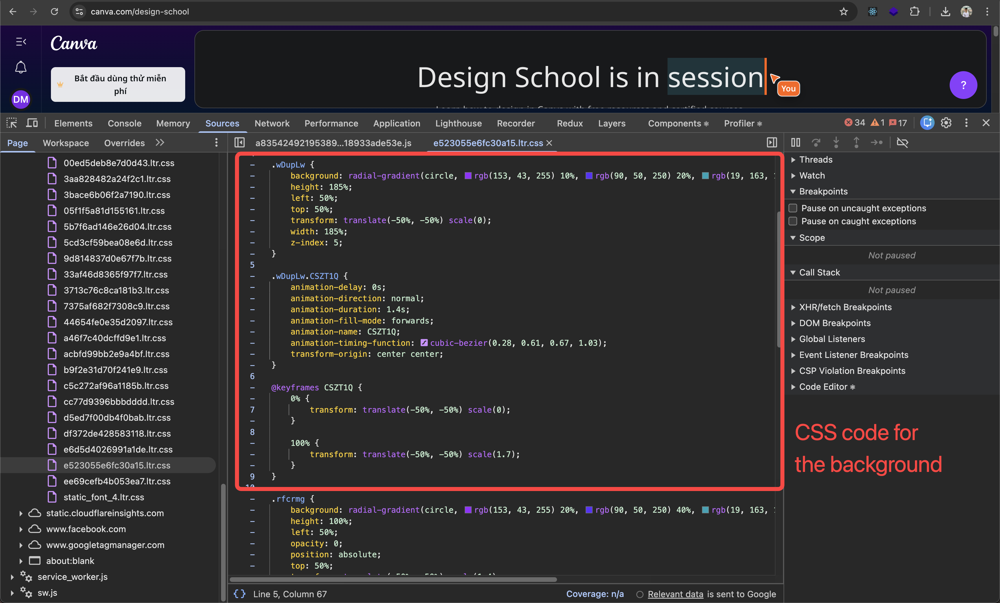

# canva-globe-anim

> [!WARNING]
> Disclaimer: this is for personal learning purpose only. All the assets used in this project are owned by Canva.

<div align="center">
  
</div>

# Run Locally

```bash
npm install
npm run dev
```

Then open http://localhost:5173 to see the app.

# How I did it

First, this animation can only be seen if you have never clicked the globe before. If you happen to click it, you will need to use another account

## Small globe animation

Rive file for this animation can be easily found when inspecting React component:

<div align="center">
  
</div>

Then preview the Rive file in [Rive app](https://www.rive.rip/) and get State Machine name and Input names

<div align="center">
  
</div>

Base on that we can create a simple Rive animation with React

## Full page globe animation

This one is a bit tricky, because there are 2 problems:

1. There's no Rive file display when inspecting React component
2. The animation happens for a short period of time then unmounted, which interrupts debugging process

Below are the solutions for both problems:

While the animation is playing, quickly inspect React component and select any selectable props which can open Sources

<div align="center">
  
</div>

Then find around that file, you should see a .riv file

<div align="center">
  
</div>

With Rive file, you can repeat the same process as small globe animation to get State Machine name and Input names

But it doesn't look the same as Canva, background is black: 

<div align="center">
  
</div>

If you set background to transparent:

```tsx
<RiveComponent
  style={{
    width: "100vw",
    height: "100vh",
    background: "transparent",
  }}
/>
```

It looks like this, notice that the background color is still missing (left), we need it to look the same as Canva (right):

| Current | Canva |
|---------|-------|
|  |  |

To get the background color, you can click the small globe icon to trigger the full page animation again, then quickly inspect the element to find the canvas, then set `display: none` to hide it to pause the animation

<div align="center">
  
</div>

Below that you should see the div with background color, click the css file to open Sources

<div align="center">
  
</div>

There you should see the background color code

<div align="center">
  
</div>